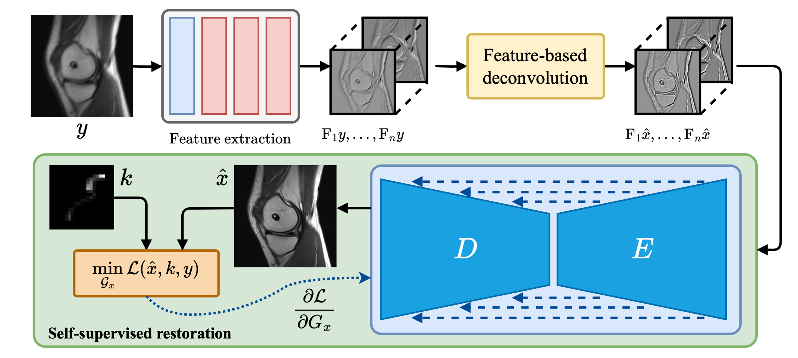

# Leveraging Classic Deconvolution and Feature Extraction in Zero-Shot Image Restoration

[Run in Colab 🟡▶️](https://colab.research.google.com/drive/12NqwB5Ff0zd5k6TtzosNsDCOnO4UmEnc?usp=sharing) [`light-sheet applications`]

Non-blind deconvolution aims to restore a sharp image from its blurred counterpart given an obtained kernel. Existing deep neural architectures are often built based on large datasets of sharp ground truth images and trained with supervision. Sharp, high quality ground truth images, however, are not always available, especially for biomedical applications. This severely hampers the applicability of current approaches in practice. In this paper, we propose a novel non-blind deconvolution method that leverages the power of deep learning and classic iterative deconvolution algorithms. Our approach combines a pre-trained network to extract deep features from the input image with iterative Richardson-Lucy deconvolution steps. Subsequently, a zero-shot optimisation process is employed to integrate the deconvolved features, resulting in a high-quality reconstructed image. By performing the preliminary reconstruction with the classic iterative deconvolution method, we can effectively utilise a smaller network to produce the final image, thus accelerating the reconstruction whilst reducing the demand for valuable computational resources. Our method demonstrates significant improvements in various real-world applications non-blind deconvolution tasks.

